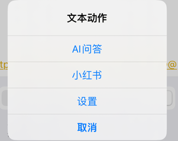
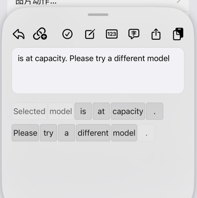

# KayokoX

多功能剪切板，基于OwnGoalStudio和mlgm66版本进行二次开发

支持ios16~ios17，roothide

原作者：AlexandraAurora
## Credits

- Original project: [AlexandraAurora/Kayoko](https://github.com/AlexandraAurora/Kayoko)
- Based on: [OwnGoalStudio/Kayoko](https://github.com/OwnGoalStudio/Kayoko)
- Based on: [mlgm66/Kayoko](https://github.com/mlgm66/Kayoko)

## License

GPLv3. See [`COPYING`](COPYING).

## 功能介绍
### 隐私模式
在弹窗界面的文字会随机打码

### 悬浮预览
开启后,复制文字或者图片会出现悬浮小球，点击后可以进入内容界面操作；致敬乌贼的hammerIt

双击悬浮小球，快速打开链接操作

### 文本动作
添加文本动作后，在内容操作界面，点击"链接+"图标，可以快速跳转操作，配置多个动作则出现列表选择，配置一个默认打开

### 图片动作
功能同文本动作
### 图片双击动作
添加动作后，在图片内容界面，双击图片，可以快速执行动作
### 组合筛选
剪切板和收藏夹，都支持组合筛选，按照分类和应用分类筛选

### 分词预览+二次分词
文本操作界面，支持分词预览，支持"选序"，长按单词可以再进行二次分词

### URL Scheme
其他 App 可以通过 URL Scheme 唤起 KayokoX 面板：

| URL | 作用 |
| --- | --- |
| `kayokox://open` | 弹出面板（任意 host 或不带 host 均可，如 `kayokox://`） |
| `kayokox://close` / `kayokox://hide` | 收起面板 |
| `kayokox://toggle` | 面板可见时收起，隐藏时弹出 |

在输入框获得焦点时调用 `kayokox://open`，弹出面板选中条目后可自动粘贴回原输入框（与手势唤起行为一致）。
